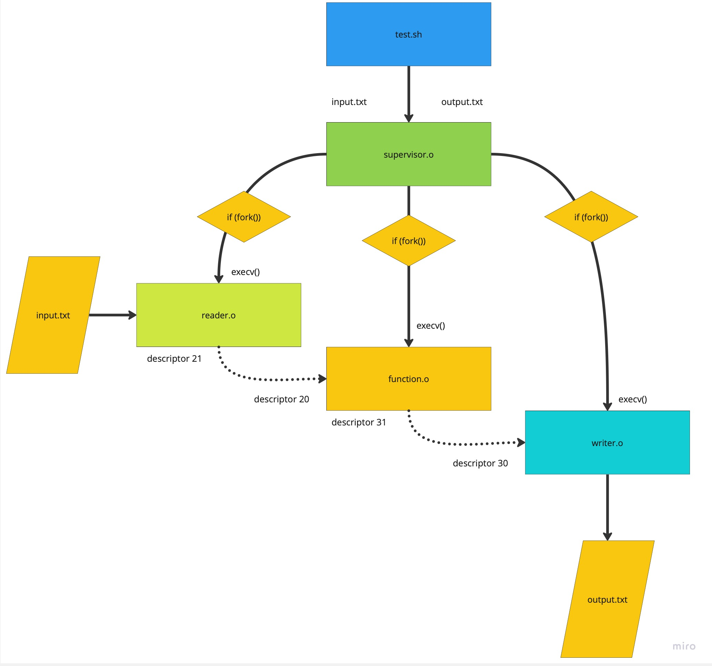
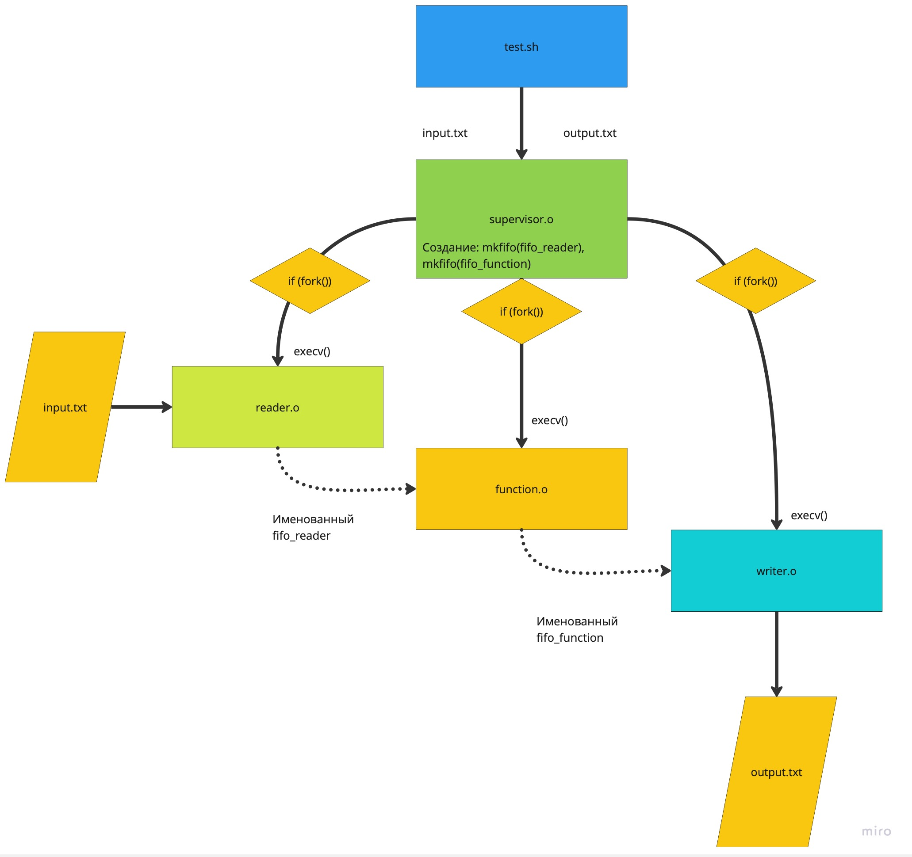
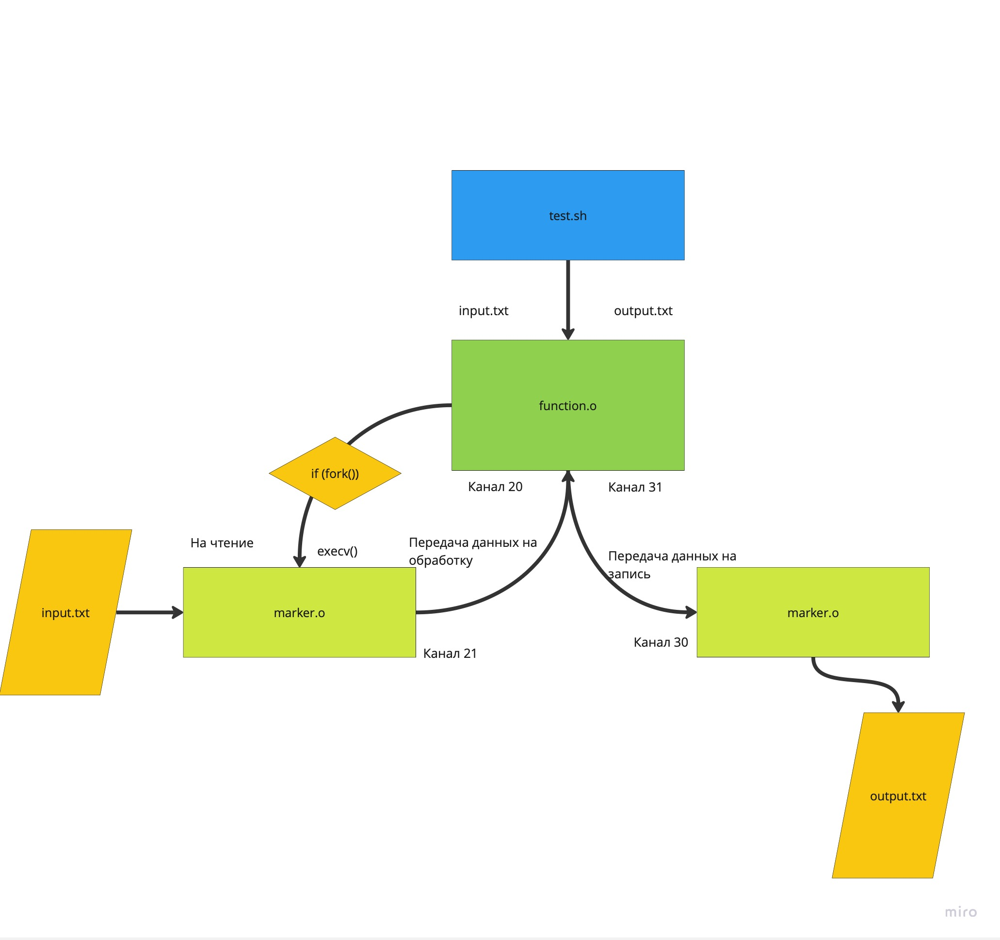

# Отчет ИДЗ 1
## Выполнил Парахин Николай, БПИ 212
## Вариант 14

---
Условие: 

Разработать программу, вычисляющую отдельно число пропис- ных и строчных букв в заданной ASCII-строке.

---
## Результат работы программы на 4 балла
Результат программы представлен в папке tests в файлах output: [тесты](for4/tests). 
Примерная схема работы программы:

## Результат работы программы на 5 баллов
Результат программы именованными каналами представлен в папке tests в файлах output: [тесты](for5/tests). 
Примерная схема работы программы:

## Результат работы программы на 6 баллов
Результат работы программы с неименованными каналами представлен в папку tests в файлах output: [тесты](for6/tests)
Примерная схема работы программы:

Результаты работ выше приведенных программ эквиваленты:

fileFilefileFile -> 2 14 

wcpcpDAIOWHdwdjdjwpajAWDopwadk -> 9 21 

wacpwponnawGPAIENIGwASDOAWpdwpajdawcdpasvvfuz -> 14 31 

AAAAAAAAAAAAAABBBBBBBBBBAAAAABBBBBAABEJKEKDKDKDKFW -> 50 0 

ajdawdjpwodjpoawjfpajfopajfjwfpojfawpjfjpawjfpajvpioevboefhiowhfbopafefiwoiawfbabw0awdhfahwaopwbcawcaowdhaiovnaqpwjofjhawdncioancawcoaowc -> 0 136 

В каждой папке tests по 5 тестов. Для удобства написаны скрипты тестирования __test.sh__ и рекомплиляция __recomp.sh__ всех файлов с исходным кодом в выходной файл (.o).
